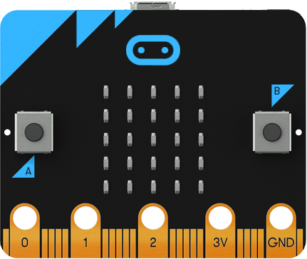
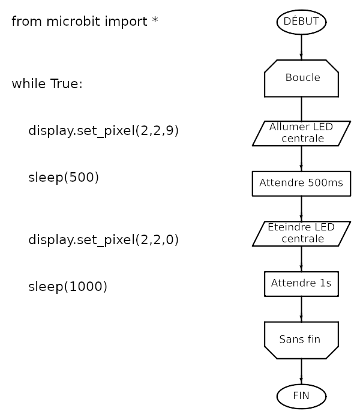
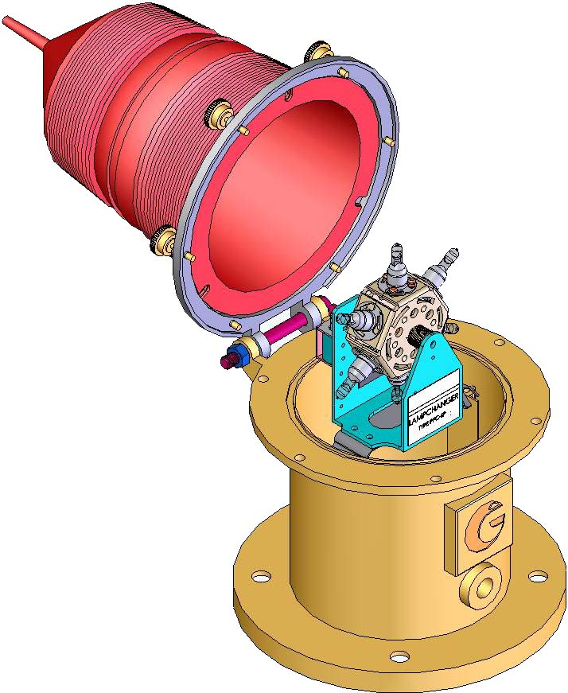
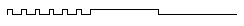

# Programmation Microbit MicroPython AP_P1M

## Activité 1 – Led et délais

Prérequis :
    • Cours programmation algorigramme : CP-1 et CP-2
    • Cours programmation C : CP-C01, CP-C02, CP-C03 et CP-C04

Description de l’application :

Commander l’allumage ou l’extinction d’une Led rouge avec des délais à l’aide d’un programme implanté dans la carte Microbit.

Matériel et montage :

    • Une carte Microbit.
    • Un câble USB pour relier la carte Microbit au PC.

Algorigramme de l’application :
L’algorigramme suivant décrit le fonctionnement de l’application et permet l’élaboration d’un programme avec les logiciels suivants :

Programme Micropython pour Microbit

### Question 1 :

a) Editer le programme suivant sous https://python.microbit.org/v/2 avec Google Chrome  (sans oublier de le sauvegarder) avant de le téléverser pour vérifier son bon fonctionnement :

b) Dans le document réponse, indiquer le lien (par des flèches) entre l’algorithme de l’application et le programme micropython Microbit.

c) Modifier le programme pour obtenir un clignotement plus rapide de la Led rouge.
Valider votre modification du programme en le téléversant avant de le copier dans le document réponse sans oublier de mettre des commentaires.

## Programme micropython Microbit de simulation d’une balise maritime :

Cette nouvelle application consiste à simuler les clignotements d’une balise maritime en utilisant la Led rouge précédente.

Toutes les 10s, la balise maritime émet 6 scintillements rapides d’une durée de 200ms toutes les 600ms suivis d’un éclat long de 3s :

### Question 2 :

a) Quelle est la durée de l’occultation qui suit l’éclat long ?

b) Réalisez un nouveau programme en micropython pour Microbit pour simuler le rythme de la balise (Led rouge).

Vérifiez son fonctionnement avant de le copier dans le document réponse sans oublier de mettre des commentaires.

c) Réalisez d’autres simulations à l’aide du tableau des rythmes suivants :

|Position de roues|Caractère des signaux|Durée de |Période|Taux de|
|---|---|---|---|---|
|codeuses| |Lum./ Obs.||Travail|

|Décimale|Hexa||en Secondes|||
|---|---|---|---|---|---|
|0|0|3 éclats|L = 0,5|12 sec|0,13|
|0|1|4 éclats |L = 0,5|15|0,13
|0|2|5 éclats (à éviter)|L = 0,5|20|0,13|
|0|4|Scintillants continus|L = 0,2|1,2|0,17|
|0|5|3 scintillements|L = 0,2|10|0,06|
|0|6|6 scintillements + 1 éclat long|L = 0,2 et 3|15|0,28|
|0|7|9 scintillements|L = 0,2|15|0,12|
|0|8|9 scintillements|L = 0,6|15|0,36|
|0|9|Scintillants rapides continus|L = 0,3|0,6|0,50|
|0|A|3 scintillements rapides|L = 0,3|5|0,18|
|0|B|6 scintillements rapides + 1 éclat long|L = 0,3 et 3|10|0,48|
|0|C|9 scintillements rapides|L = 0,3|10|0,27|
|0|D|Eclats réguliers|L = 0,5|2,5|0,20|
|0|F|2 éclats|L = 0,5|6|0,17|
|1|0|3 éclats|L = 1|12|0,25|
|1|1|4 éclats|L = 1|15|0,27|
|1|2|5 éclats|L = 1|20|0,25|
|1|4|5 éclats S A D O|L = 0,5|20|0,13|
|1|5|Scintillants continus|L = 0,6|1,2|0,50|
|1|6|3 scintillements|L = 0,6|10|0,18|
|1|7|6 scintillements + 1 éclat long|4|5 éclats S A D O|L = 0,5|20|0,13|
|1|5|Scintillants continus|L = 0,6|1,2|0,50|
|1|6|3 scintillements|L = 0,6|10|0,18|
|1|7|6 scintillements + 1 éclat long|4|5 éclats S A D O|L = 0,5|20|0,13|
|1|5|Scintillants continus|L = 0,6|1,2|0,50|
|1|6|3 scintillements|L = 0,6|10|0,18|
|1|7|6 scintillements + 1 éclat long|L = 0,6 et 3|15|0,44|
|1|8|Occultations régulières|O = 1|4|0,75|
|1|9|2 Occultations|O = 1|6|0,67|
|1|A|3 Occultations|O = 1,5|12|0,62|
|1|B|4 Occultations|O = 1|12|0,67|
|1|C|Isophase|L = 2|4|0,50|
|1|D|Eclats réguliers|L = 1|4|0,25|
|1|E|Eclats longs|L = 3|10|0,30|
|1|F|2 éclats|L = 1|6|0,33|
|2|0|Scintillants rapides continus|L = 0,2|0,6|0,33|
|2|1|3 scintillements rapides|L = 0,2|5|0,12|
|2|2|6 scintillements rapides + 1 éclat long|L = 0,2 et 3|10|0,42|
|2|3|9 scintillements rapides|L = 0,2|10|0,18|
|2|4|Fixe|||1,00|
|2|5|Lettre morse A|L = 1 et 3|12|0,33*|
|2|6|Lettre morse U|L = 0,4 et 1,2|15|0,13*|
|2|7|Eclats diversement groupés (2 + 1)|L = 0,6|10|0,18*|
|2|8|2 éclats en 10s (danger isolé)|L = 1|10|0,20*|
|2|9|2 + 1 Occultations 10s (à éviter)|L = 3,8 et 0,6|10|0,82*

* Ne figurent pas sur de codage du programmateur 20W Adur 5000
¨ Rythme économique

Retrouver l'ensemble des codes dans [IBIM 0260 - Rythmes normalisés à utiliser pour les feux de signalisation maritime](https://www.yachter.fr/pdf/rythme%20des%20feux.pdf)
