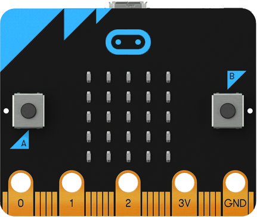

# Programmation Microbit MicroPython AP-IE03P

## Activité 3 – structure de contrôle if else imbriquées

Structure de contrôle if else imbriquées et les entrées/sorties
Le but de cette activité est de comprendre comment on peut lire l'état d'une entrée, faire un choix selon cet état (0 ou 1) et modifier l'état d'une sortie.

On va simuler les boutons poussoirs Marche/Arrêt que l’on trouve sur les systèmes industriels avec les boutons A et B de la carte Microbit.

Structure du programme à compléter :

<pre>
<code>
#------------------------------------
# AP-IE03 Programmation de base
# Structure if else imbriquées
#
# Nom :
# Date :
# ------------------------------------

# Add your Python code here. E.g.
from microbit import *

etat_bpm = 0
etat_bpa = 0

while TRUE : # A compléter

# il faut lire les 2 BP A et B avec is_pressed()et gérer etat_bpm et etat_bpa

# Il faut allumer ou éteindre la LED avec display.set_pixel(x, y, value)
</code>
</pre>

Que doit faire le programme ? Au départ, la LED devra être éteinte.
Si on appuie sur BP B, la LED centrale doit s'allumer.
Sinon, si on appuie sur BP A, la LED  centrale doit s'éteindre.

Pour obtenir de l'aide sur les fonctions is_pressed(), display,set_pixel( et sur la structure de contrôle if, allez sur les pages https://microbit-micropython.readthedocs.io/fr/latest/

Pour programmer :
    • En ligne avec  https://python.microbit.org/v/2 avec Google Chrome
    • ou bien Mu s’il est installé sur le PC

On allumera la LED au centre de la matrice de LEDs

Exercice 1 : Donnez l’algorigramme de la fonction while True

Réponses :
 
 
 

Exercice 2 : Complétez le programme et testez-le.

Exercice 3 : Si on appuie sur les 2 boutons poussoirs, lequel est prioritaire ? pourquoi ?

Réponses :
 
 
 

## VERSION 2
Dans cette 2ème version, on veut que ce soit BPA qui soit prioritaire.

Exercice 4 : Donnez l’algorigramme de la fonction while True

Réponses :
 
 
 

Exercice 5 : Complétez le programme et testez-le.

Conclusion :
 
 
 

Documents à rendre à la fin de la séance :
- Ce document complété.
- Les deux programmes imprimés.
