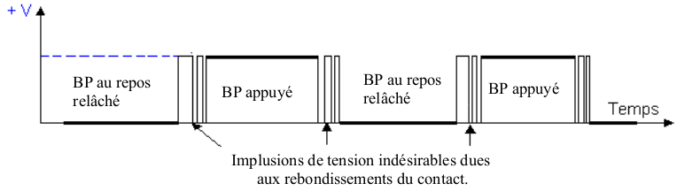
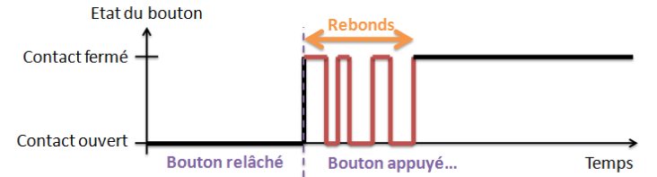

# Programmation Microbit MicroPython AP-IE04P

## Activité 4 – Structure de contrôle if else et Anti-rebond.

Le but de cette activité est de comprendre le phénomène de rebond sur les boutons poussoirs et de voir comment on peut rendre un programme insensible à ces rebonds avec des fonction spécifique.

### Objectifs : Simulation d’un télérupteur.

Structure du programme à compléter :

<pre>
<code>
#-----------------------------------
# AP-IE04 Programmation de base
# Contrôle if else et Anti-rebond
#
# Nom :
# Date :
#-----------------------------------
from microbit import *

etat_bp = 0
etat_prec_bp = 0
etat_led = 0

while True :
</code>
</pre>

#### Que doit faire le programme ?

Après avoir configuré les entrées/sorties, la LED devra être éteinte.

Lors d'un 1er appui sur le BP, la LED devra s'allumer et rester allumée lorsqu'on relâchera le BP.

Lors d'un 2ème appui sur le BP, la LED devra s'éteindre et rester éteinte lorsqu'on relâchera le BP, ainsi de suite...

Pour cela, il faut détecter le passage de l'état bas (0) à l'état haut (1) du BP. On devra donc connaître l'état actuel de BP et son état précédent.
Il faudra aussi mémoriser l'état de la LED afin de pouvoir l'inverser en cas d'appui sur le BP.

Pour obtenir de l'aide sur les fonctions is_pressed(), display,set_pixel( et sur la structure de contrôle if, allez sur les pages https://microbit-micropython.readthedocs.io/fr/latest/

Pour programmer :
    • En ligne avec  https://python.microbit.org/v/2 avec Google Chrome
    • ou bien Mu s’il est installé sur le PC

On allumera la LED au centre de la matrice de LEDs

### Exercice 1 : Donnez l’algorigramme de la fonction while True

Réponses :
 
 
 
 

### Exercice 2 : Complétez le programme et testez-le.

On constate un dysfonctionnement dus aux rebonds du bouton poussoir.
Comme nous pouvons le voir sur ce chronogramme, nous n’avons pas un signal propre et rectangulaire.

A chaque appui ou relâchement du BP nous avons des impulsions parasites qui peuvent durer quelques dizaines de millisecondes, peu gênantes pour l’utilisateur qui sera limité à une dizaine d’appui par secondes. Ces impulsions sont importantes pour un microcontrôleur qui travaille à la microseconde.

Ces rebonds existent aussi dans des système industriels sur des fins de course par exemple.

Comme nous le voyons sur ce zoom d’un appui sur un BP, Il faudra s’assurer d’un temps supérieur au temps des rebonds pour avoir un état stable.

La carte Microbit gère les anti-rebonds avec des fonctions spécifiques pour les [BP A et B](
https://microbit-micropython.readthedocs.io/fr/latest/button.html)

Voici les 3 fonctions :

**is_pressed()**
	Returns True if the specified button button is currently being held down, and False otherwise.

**was_pressed()**
Returns True or False to indicate if the button was pressed (went from up to down) since the device started or the last time this method was called. Calling this method will clear the press state so that the button must be pressed again before this method will return True again.

**get_presses()**
	Returns the running total of button presses, and resets this total to zero before returning.

### Exercice 3 : Proposer un programme qui utilise la fonction *get_presses()*

Documents à rendre à la fin de la séance :
    • Ce document complété.
    • Le  programme final imprimé.
