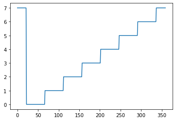

# Programmation Microbit MicroPython AP-IE05P

## Activité 5 – Structure de contrôle elif équivalente switch/case

Merci de lire TOUT le sujet avant de commencer le travail.

Structure de contrôle elif en microptyhon pour remplacer le switch/case, entrée analogique et plage de valeurs pour remplacer la fonction map().

Le but de cette activité est de mettre en œuvre la structure de contrôle elif pour remplacer un switch/case.

Pour cela on lira la position de la boussole qui remplacera un potentiomètre et on calculera une plage de valeurs. Ensuite, en fonction de cette plage, on affichera une flèche, le choix de la flèche devra se faire grâce à la structure de contrôle elif.

Matériel : Une carte Microbit

Structure du programme à compléter :

<pre>
<code>
#-------------------------------------
# AP-IE05 Programmation de base
# Contrôle elif, boussole et plage
#
# Nom :
# Date :
#-------------------------------------
# Add your Python code here. E.g.
from microbit import *

def plage() :
  return ((compass.heading()-22)//45)%8

if not compass.is_calibrated():
  compass.calibrate()

while True :
 if plage() == 0 :
    display.show(Image.ARROW_NW)
 elif plage() == 1 :
    display.show(. . . . . . .)
  elif # à compléter
</code>
</pre>

Que doit faire le programme ?

Fonction while True:
    1. Fonction loop() : Lire la valeur de la boussole avec la fonction plage
    2. Suivant la valeur de plage afficher une des flèches : Image.ARROW_E,  Image.ARROW_N, Image.ARROW_NE, Image.ARROW_NW, Image.ARROW_S, Image.ARROW_SE, Image.ARROW_SW, Image.ARROW_W

Pour obtenir de l'aide sur les fonctions is_pressed(), display,set_pixel( et sur la structure de contrôle if, allez sur les pages https://microbit-micropython.readthedocs.io/fr/latest/

Pour programmer :
- En ligne avec  https://python.microbit.org/v/2 avec Google Chrome
- ou bien Mu s’il est installé sur le PC

Voici la fonction plage : ((compass.heading()-22)//45)%8

le symbole // correspond à la division entière et le % au modulo (le reste de la division entière)

	Angle de la boussole (compass.heading)

Travail demandé :
### 1) Justifier la fonction plage et la formule ((compass.heading()-22)//45)%8

### 2) Compléter le programme et tester le

### 3) Tester le programme de la page :  
https://microbit-micropython.readthedocs.io/en/v1.0.1/compass.html

Expliquer le fonctionnement et expliquer l’utilisation de la liste des images Image.ALL_CLOCKS

Pensez à imprimer et rendre l’ensemble de vos programmes commentées !
