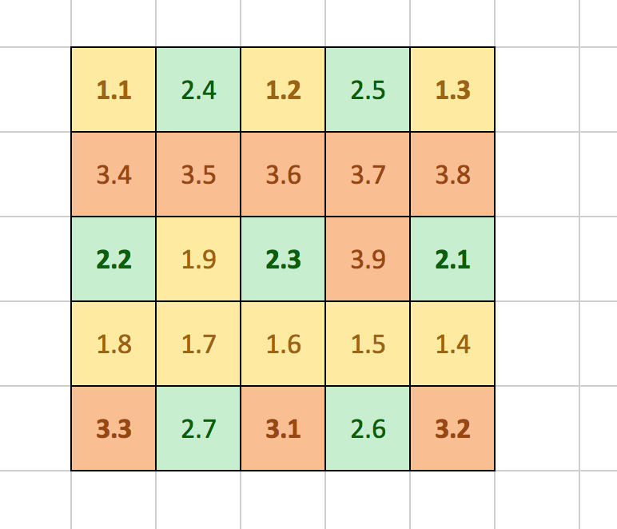
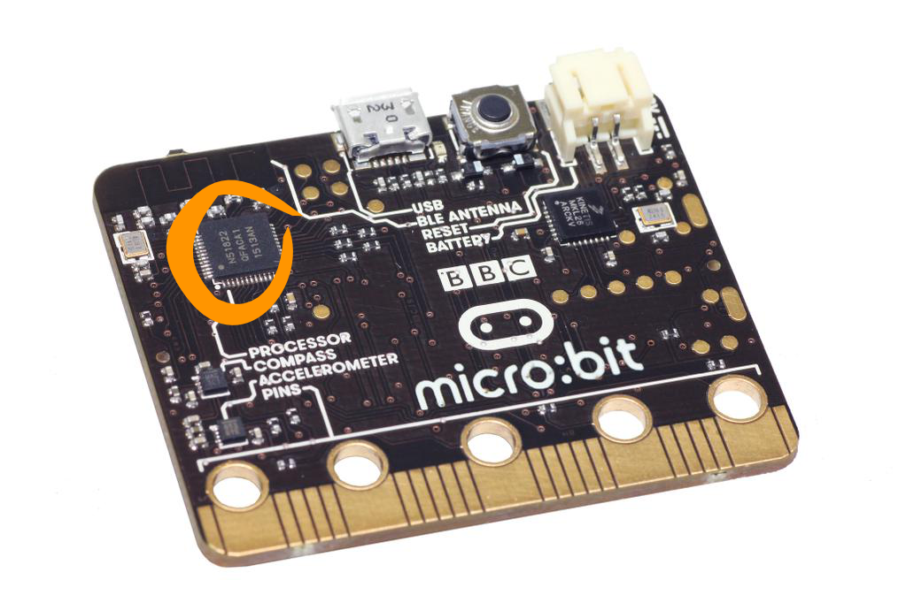
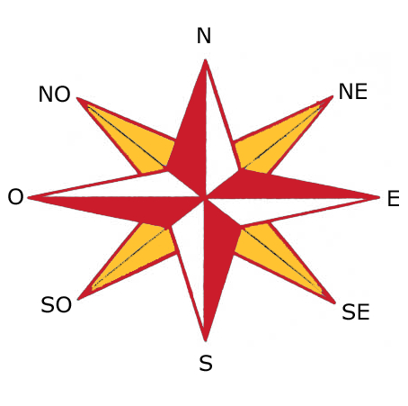
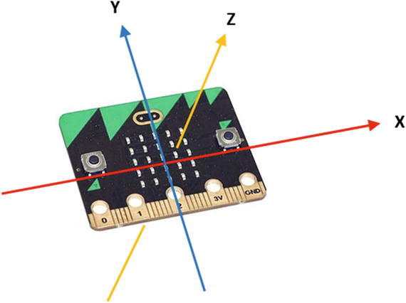
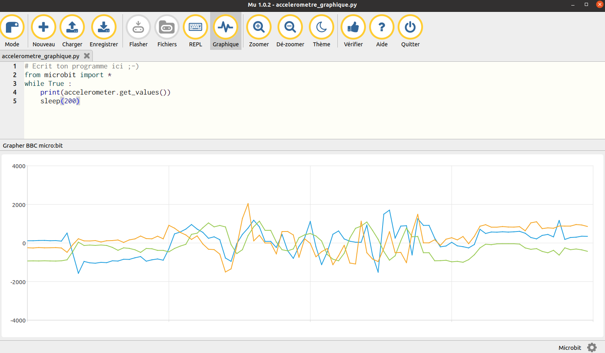
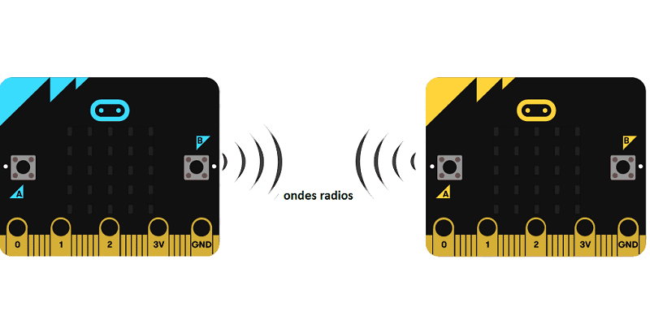
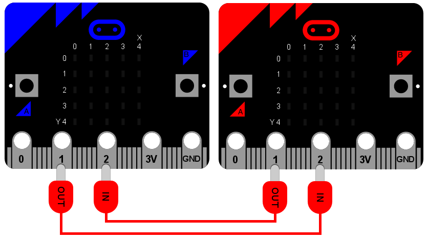

Programmation de base de la carte Microbit
==========================================


Attention il faut avoir installer le kernel ubit pour Jupyter pour travailler avec ce Notebook Jupyter
https://github.com/takluyver/ubit_kernel

**Il faut brancher une carte Microbit avant d'exécuter les cellules en Micropython !**

 - [Activité pratique Informatique embarquée AP-IE01P](#Activité-pratique-Informatique-embarquée-AP-IE01P)
 - [Activité pratique Informatique embarquée AP-IE02P](#Activité-pratique-Informatique-embarquée-AP-IE02P)
 - [Activité pratique structure de contrôle If multiple AP-IE03P](#Activité-pratique-structure-de-contrôle-If-multiple-AP-IE03P)
 - [Programmation de base structure de contrôle if else et mémoire AP-IE04P](#Programmation-de-base-structure-de-contrôle-if-else-et-mémoire-AP-IE04P)
 - [Le capteur de température interne](#Le-capteur-de-température-interne)
 - [Boussole](#Boussole)
 - [L'accéléromètre](#Accéléromètre)
 - [Accéléromètre : graphique avec Mu-code](#Graphique-avec-Mu-code)
 - [Radio et Bluetooth](#Radio-et-Bluetooth)
 - [Enfin pour finir voici la communication Réseau ou Network](#Enfin-pour-finir-voici-la-communication-Réseau-ou-Network)


```python
import microbit # bibliothèque nécessaire pour travailler avec la carte microbit
microbit.display.clear() # on efface les leds
```


Activité pratique Informatique embarquée AP-IE01P
-------------------------------------------------

### *Programmation de base : structure de contrôle If*

**Ce programme allume une LED si on appuie sur le bouton poussoir ‘a’.**


```python
# programme 1
for i in range(100): # remplace While True : pour ne pas bloquer !
    if microbit.button_a.is_pressed():
        microbit.display.set_pixel(2,2,9)
    microbit.sleep(100) # spécifique Jupyter Notebook Microbit
```


Syntaxe Micropython
-------------------

La syntaxe de Micropython est la même que celle de Python.

Je profite de ce premier exemple en micropython pour présenter la mise
en forme

-   Après une boucle for on place une liste d'élements finis que l'on va appeler successivement et on doit
    impérativement mettre un **:** en fin de ligne
-   Toutes les lignes qui sont dans cette boucle devront être
    **indentées** (on se décale d’une tabulation de 4 caratères
    habituellement)
-   Après un if on a la même chose, une condition et un **:**  
-   Toutes les lignes qui correspondent au then sont **indentées**,
    décalage d’une tabulation, soit 2 tabulations pour la ligne
    microbit.display.set_pixel()

*Remarque* : pas besoin de parenthèse pour la condition du if et pas
besoin de ; à la fin de chaque ligne, les accolades sont remplacées par
des : et l’indentation.

### Remarque Importante :

Dans les programmes qui suivent vous ne trouverez par un **While True :** pour faire la boucle principale mais 2 lignes :

```python
for i in range(100): 
    ...
    ...
    microbit.sleep(100)
```
Cela vous donne dans ce cas 100 * 100ms soit 10 secondes pour essayer le programme, ensuite la boucle for est finie et on pourra continuer la progression dans ce Notebook ou bien retester ce programme.

Évidemment, vous pouvez changer le temps avec *for i in range(300)* vous aurez 30 secondes poue essayer votre programme.

Si vous mettez un While True : vous allez donner la main au microbit mais pour toujours.

Dans ce cas, pour avoir la main et tester d'autres programmes dans ce Notebook, il faudra aller dans la rubrique Noyau et redémarrer le noyau. 


### Q1) Que se passe-t-il si j’appuie sur le bouton poussoir ‘a’ et que je le relâche ?

<span style="color:red">La LED s’allume et ne s’éteint pas ! <br> Le
programme ne fait que ce qu’on lui dit clairement, on ne lui a jamais
demandé d’éteindre la LED !</span>

Activité pratique Informatique embarquée AP-IE02P
-------------------------------------------------

### *Programmation de base : structure de contrôle If … else*

**Ce programme allume une LED si on appuie sur le bouton poussoir ‘a’,
l’éteint dans le cas contraire.**


```python
# programme 2
for i in range(100):
    if microbit.button_a.is_pressed(): # bouton appuyé ?
        microbit.display.set_pixel(2,2,9)
    else :
        microbit.display.set_pixel(2,2,0)
    microbit.sleep(100)
```

### Q2) Expliquez le rôle de else (sinon)

<span style="color:red">Le “else” sinon permet d’éteindre la LED quand
on appuie pas sur le bouton</span>

Utilisation d’un bouton poussoir interne
----------------------------------------

### Classe Bouton

Représente un bouton.

`Remarque :`

`Cette classe n'est pas réellement disponible pour l'utilisateur, elle n'est utilisée que par les deux instances du bouton, qui sont fournies déjà initialisées.`

*is_pressed()*

    Retourne Vrai si on appuie actuellement sur le bouton spécifié et sinon Faux.

*was_pressed()*

    Retourne Vrai ou Faux pour indiquer si on a appuyé sur le bouton depuis le démarrage de l'appareil ou depuis le dernier appel de cette méthode.   
     À chaque appel, l'état du bouton revient à Faux.  
     Il faut un nouvel appui sur le bouton pour qu'il revienne à True.

*get_presses()*

    Retourne le nombre total de fois où l'on a appuyé sur le bouton,  
    et remet ce total à zéro à la fin de cette méthode.

https://microbit-micropython.readthedocs.io/fr/latest/button.html


Affichage sur les LED
---------------------

### Display

Ce module contrôle l’affichage de la matrice de LED 5x5 situé sur le devant de
votre carte. Il peut-être utilisé pour afficher des images, des animations et même du texte.

*microbit.display.set_pixel(x, y, value) :*

    Définit la valeur(value) de la luminosité de la LED de la colonne x et de la ligne y.

    Cette valeur est un entier compris entre 0 (éteint) et 9 (brillante).

https://microbit-micropython.readthedocs.io/fr/latest/display.html


Algorigrammes
-------------

### Q3) Donner l’algorigramme du programme n°1

 Algorigramme du simple
**Si**

### Q4) Donner l’algorigramme du programme n°2

 Algorigramme du **Si
– sinon**

Programmation de base : structure de contrôle If multiple AP-IE03P
------------------------------------------------------------------

### Simulation des boutons Marche Arrêt industriels


-   Le bouton Marche vert est simulé par le bouton b
-   Le bouton Arrêt rouge est simulé par le bouton a

Si j’appuie sur le bouton ‘b’ la sortie est active j’allume une LED  
Sinon je ne fais rien !

Si j’appuie sur le bouton ‘a’ la sortie est inactive j’éteins une LED  
Sinon je ne fais rien !

### Q5) Proposer le programme


```python
# programme 3
for i in range(100):
    if microbit.button_b.is_pressed(): # bouton b : Marche
        microbit.display.set_pixel(2,2,9)
    if microbit.button_a.is_pressed(): # bouton a : Arrêt
        microbit.display.set_pixel(2,2,0)
    microbit.sleep(100)
```

### Q6) Que se passe-t-il si on appui plusieurs fois sur le bouton Marche ? (sans appui sur Arrêt)

<span style="color:red"> La LED reste allumée, quelque soit le nombre
d’appui sur le bouton Marche </span> <br/> <br/>

### Q7) Que se passe-t-il si on appui plusieurs fois sur le bouton Arrêt ? (sans appui sur Marche)

<span style="color:red"> La LED reste éteinte, quelque soit le nombre
d’appui sur le bouton Arrêt </span> <br/> <br/>

### Q8) Proposer une solution pour que l’arrêt soit prioritaire


```python
# programme 4
for i in range(100):
    if microbit.button_a.is_pressed(): # bouton a : Arrêt
        microbit.display.set_pixel(2,2,0)
    elif microbit.button_b.is_pressed(): # bouton b : Marche
        microbit.display.set_pixel(2,2,9)
    microbit.sleep(100)
```

Algorigrammes
-------------

### Q9) Donner l’algorigramme du programme n°3


Programmation de base : structure de contrôle if else et mémoire AP-IE04P
-------------------------------------------------------------------------

### Télérupteur

**Si j’appuie sur un des boutons poussoirs la lampe change d’état.**  
La lampe est éteinte, j’appuie sur un BP, elle s’allume. J’appuie de
nouveau sur un BP, la lampe s’éteint.


```python
# programme 5
valeur = 0 # pour avoir la lampe éteinte
for i in range(100):
    if (microbit.button_b.get_presses() + microbit.button_a.get_presses())%2 == 1 :
        valeur = 9-valeur #valeur = 0 : led éteinte, valeur = 9 : led allumée
        # on inverse à chaque fois que l'un des boutons a changé d'état un nombre impair de fois
        microbit.display.set_pixel(2,2,valeur)
    microbit.sleep(200)
```

### La carte Microbit gère les antirebonds.

### Modulo en python

r = x modulo n, r est le reste de la division entière de x par n.  
Exemple r = 3 modulo 2, r vaut 1 .  
Notation en python r = x%2, r = 0 si x est pair, r = 1 si x est impair.


### Q10) Expliquez la ligne :

### if (microbit.button_b.get_presses() + microbit.button_a.get_presses()) %2 == 1

<span style="color:red"> microbit.button_b.get_presses() +
microbit.button_a.get_presses() donne le nombre de fois que l’on a
appuyé sur le bouton a ou b<br/> Si on appuie un nombre de fois pair
alors la lampe garde son état, sinon elle doit changer d’état.<br/>
</span>

Algorigrammes
-------------

### Q11) Donner l’algorigramme du programme n°5


Boutons tactiles
----------------

Les entrées 0,1,2 possèdent des entrées tactiles  
Voici un petit exemple :


```python
# programme 6
from microbit import *
for i in range(100):
    if pin0.is_touched():
        display.show(Image.HAPPY)
    else:
        display.show(Image.SAD)
    microbit.sleep(100)
```

**Le plus simple étant de toucher avec 2 doigts de la main gauche le ‘0’
sur le connecteur et avec 2 doigts de la main droite le ‘GND’ sur le
connecteur**

La matrice LED
----------------------

Pour finir voici quelques exemples avec la matrice LED 


```python
# programme 7
while True:
    if microbit.button_a.was_pressed(): #appuyer sur le bouton A pour sortir de la boucle infinie
        break
    microbit.display.scroll("Bonjour", delay=200) #attention il faut attendre un cycle complet avant d'arrêter
```

### Le programme ci-dessus, vous donne un exemple d’un affichage défilant (scroll) avec un avancement lent

Vous pouvez changez la vitesse avec le delay

### Voici un autre exemple que l’on peut tester sur Mu avec REPL


```python
import microbit
display.show('Bonjour !', wait=False, loop=True)
```

**En savoir plus**
<https://microbit-challenges.readthedocs.io/en/latest/tutorials/display.html>

<https://microbit-micropython.readthedocs.io/fr/latest/tutorials/images.html>

# Nous allons utiliser d’autres capteurs de la carte 


Connaître l’ensemble des Images


```python
from microbit import * 
print(dir(Image))
```

Vous affichera l’ensemble des noms des images possibles et des attributs de image.

Au niveau logiciel, voici l’ensemble des ‘modules’ ou bibliothèques disponibles
-------------------------------------------------------------------------------


```python
help('modules')
```

    __main__          love              os                time
    antigravity       machine           radio             ucollections
    array             math              random            ustruct
    audio             microbit          speech            utime
    builtins          micropython       struct
    collections       music             sys
    gc                neopixel          this
    Plus any modules on the filesystem


```python
help(microbit)
```

    Useful stuff to control the micro:bit hardware.


### Les outils logiciels pour piloter le matériel : broches, bouton, afficheurs à LED, température, boussole …


```python
print(dir(microbit))
```

    ['__name__', 'Image', 'display', 'button_a', 'button_b', 'accelerometer', 'compass', 'i2c', 'uart', 'spi', 'reset', 'sleep', 'running_time', 'panic', 'temperature', 'pin0', 'pin1', 'pin2', 'pin3', 'pin4', 'pin5', 'pin6', 'pin7', 'pin8', 'pin9', 'pin10', 'pin11', 'pin12', 'pin13', 'pin14', 'pin15', 'pin16', 'pin19', 'pin20']


Le capteur de température interne
---------------------------------


```python
# programme 8
while True:
    if microbit.button_a.was_pressed(): #appuyer sur le bouton A pour sortir de la boucle infinie
        break
    microbit.display.scroll(microbit.temperature()) # défilement sur la carte de la température
```


Thermomètre
-----------

The thermometer on the micro:bit is embedded in one of the chips – and chips get warm when powered up.  
Consequently, it doesn’t measure room temperature very accurately.  
The chip that is used to measure temperature can be found on the left
hand side of the back of the micro:bit :



Le thermomètre sur la carte micro:bit est à l'intérieur d'un circuit intégré et ceux-ci chauffent quand ils sont sous tension.  
Aussi le capteur de température ne fait pas de mesures très précises dans la pièce.  
Le circuit intégré qui est utilisé pour mesurer la température se trouve sur le coté gauche au dos de la carte micro:bit

Boussole
--------

Programmation de base : structure de contrôle if elif pour remplacer le switch case
-----------------------------------------------------------------------------------

### La fonction switch case n’existe pas en python, on va utiliser une suite de if et elif

elif = else +if permet de tester un nombre de cas différents comme dans
un menu

### Nous allons travailler avec la boussole (compas) intégrer dans la carte Microbit

#### Définissons d’abord les images des 8 flèches de la rosace des vents




```python
# Test des flèches
fleche_N = microbit.Image("00900:00900:00900:00000:00000")
fleche_N_E = microbit.Image("00009:00090:00900:00000:00000")
fleche_E = microbit.Image("00000:00000:00999:00000:00000")
fleche_S_E = microbit.Image("00000:00000:00900:00090:00009")
fleche_S = microbit.Image("00000:00000:00900:00900:00900")
fleche_S_O = microbit.Image("00000:00000:00900:09000:90000")
fleche_O = microbit.Image("00000:00000:99900:00000:00000")
fleche_N_O = microbit.Image("90000:09000:00900:00000:00000")
microbit.display.show(fleche_N)
microbit.sleep(1000)
microbit.display.show(fleche_N_E)
microbit.sleep(1000)
microbit.display.show(fleche_E)
microbit.sleep(1000)
microbit.display.show(fleche_S_E)
microbit.sleep(1000)
microbit.display.show(fleche_S)
microbit.sleep(1000)
microbit.display.show(fleche_S_O)
microbit.sleep(1000)
microbit.display.show(fleche_O)
microbit.sleep(1000)
microbit.display.show(fleche_N_O)
```

### Avant d’utiliser la boussole, il faut la calibrer sinon les relevés sont faussés.

**Attention**  
La calibration de la boussole met le programme en pause tant qu’elle
n’est pas achevée.  
La calibration se fait au travers d’un jeu qui dessine un cercle sur
l’afficheur LED au gré des rotations de la carte.  
https://microbit-micropython.readthedocs.io/fr/latest/compass.html


```python
microbit.compass.calibrate()
```


```python
# programme 9
fleche_N = microbit.Image("00900:00900:00900:00000:00000")
fleche_N_E = microbit.Image("00009:00090:00900:00000:00000")
fleche_E = microbit.Image("00000:00000:00999:00000:00000")
fleche_S_E = microbit.Image("00000:00000:00900:00090:00009")
fleche_S = microbit.Image("00000:00000:00900:00900:00900")
fleche_S_O = microbit.Image("00000:00000:00900:09000:90000")
fleche_O = microbit.Image("00000:00000:99900:00000:00000")
fleche_N_O = microbit.Image("90000:09000:00900:00000:00000")
while True:
    if microbit.button_a.is_pressed(): #appuyer sur le bouton A pour sortir du programme
        break
    aiguille = (225-10 * microbit.compass.heading())%3600 // 450
    if aiguille == 0 :
        microbit.display.show(fleche_N)
    elif aiguille == 1 :
        microbit.display.show(fleche_N_E)
    elif aiguille == 2 :
        microbit.display.show(fleche_E)
    elif aiguille == 3 :
        microbit.display.show(fleche_S_E)
    elif aiguille == 4 :
        microbit.display.show(fleche_S)
    elif aiguille == 5 :
        microbit.display.show(fleche_S_O)
    elif aiguille == 6 :
        microbit.display.show(fleche_O)
    elif aiguille == 7 :
        microbit.display.show(fleche_N_O)
    else :
        microbit.display.show("99999:09990:00900:09990:99999") # erreur
```

### La boussole donne l’angle en degrés de 0° à 359° avec la fonction compass.heading()

### Q12) Expliquer la ligne : aiguille = (225 - 10 \* compass.heading())%3600 // 450

**Rappel** 
- % correspond au modulo c’est le reste de la division
entière  
- // correspond à la division entière

### Q13) Indiquer pour l’Est l’angle minimum et l’angle maximum en degrés où on affiche fleche_E

<br/> <br/>

### Q13 extra) À quoi sert le else ?

<br/> <br/>


```python
# programme 9 bis
# version profs avec une liste
Rosace_vents=[fleche_N,fleche_N_E,fleche_E,fleche_S_E,fleche_S,fleche_S_O,fleche_O,fleche_N_O] #liste pour profs
while True:
    if microbit.button_a.is_pressed(): #appuyer sur le bouton A pour sortir de la boucle infinie
        break
    aiguille = (225-10 * microbit.compass.heading())%3600 // 450
    microbit.display.show(Rosace_vents[aiguille]) # utilisation d'une liste
```

### ATTENTION les listes peuvent prendre beaucoup de RAM, surtout les listes d’images !

### La carte Microbit n’a que 32ko de RAM, micropython et MICRORAM par rapport à un PC !

L’accéléromètre
---------------



### Gestes

L’effet collatéral le plus intéressant d’un accélèromètre est la
détection des gestes.

MicroPython est capable de reconnaître les gestes suivants:

    haut-> up
    bas -> down
    gauche -> left
    droite -> right
    face en haut -> face up
    face en bas -> face down
    chute libre -> free fall
    accélération correspondant à 3, 6 ou 8 fois celle de la chute libre -> 3g, 6g ou 8g
    secousse -> shake

Voici le programme :


```python
# programme 10
from microbit import *
while True :
    if microbit.button_a.is_pressed(): #appuyer sur le bouton A pour sortir de la boucle infinie
        break
    geste = accelerometer.current_gesture()
    print(geste)
    sleep(200)
```

Il faut bouger la carte pour voir tous ces gestes

### Graphique avec Mu-code

Il faut télécharger ce programme sur la carte Microbit avec ‘Flasher’

``` python
# programme 10 bis
from microbit import *
while True :
    print(accelerometer.get_values())
    sleep(200)
```

Puis il faut passer en mode Graphique

En bougeant la carte vous devriez obtenir un graphe comme celui-ci :




Radio et Bluetooth
==================

### Le Bluetooth ne fonctionne pas en Micropython sur la carte Microbit

Il faut écrire en javascript ou en C++ pour utiliser le module Bluetooth

### L’antenne est commune au Bluetooth et à la Radio.

Concrètement on utilise l’un ou l’autre pas les 2 en même temps.

Le module Radio
------------------------



Pour l’utiliser il faut l’importer avec ‘import’

**Voici un exemple simple pour émettre en radio :**  
On émet en radio les caractères reçus depuis le clavier


```python
# programme 10 
# Emetteur radio serie
from microbit import *
import radio

radio.on() # mettre le module radio en marche
radio.config(channel=1)     # choisir un numéro de canal radio
radio.config(power=7)       # mettre le signal à puissance maximum
uart.init(115200)           # initialisation liaison série 115200 bauds

while True:                 # boucle infinie
    if microbit.button_a.is_pressed(): #appuyer sur le bouton A pour sortir de la boucle infinie
        break
    if uart.any():          # caractères reçus ? du clavier
        message=str(uart.read(),'UTF-8') # si oui, on lit le clavier
        radio.send(message) # on envoie le caractère reçu par radio
```

Comme nous pouvons le voir, on commence par démarrer le module Radio.  
On le configure sur le premier canal et on met la puissance au
maximum.  
Ensuite on initialise la liaison série (uart) à 115200 bauds

Dans la boucle sans fin : while True , l’équivalent de la fonction loop
en Arduino  
On regarde si on on a reçu un caractère depuis la liaison série avec
uart.any()  
Si on a reçu un caractère, on lit la liaison série (clavier) uart.read  
Enfin on envoie en radio le caractère reçu radio.send

<https://microbit-micropython.readthedocs.io/fr/latest/radio.html>

<https://microbit-micropython.readthedocs.io/en/latest/uart.html>

**Voici le programme pour la réception :**  
On affiche sur l’écran les caractères reçus en radio.


```python
# programme 11
# Recepteur radio
from microbit import *
import radio

radio.on()
radio.config(channel=1)     # choisir un numéro de canal radio
radio.config(power=7)       # mettre le signal à puissance maximum

while True:
    if microbit.button_a.is_pressed(): #appuyer sur le bouton A pour sortir de la boucle infinie
        break
    message_recu = radio.receive()
    if message_recu is not None:  
        if message_recu == '\r' :   
            print(message)          
            message=''            
        else :                   
            message+=message_recu
```

Pour la partie initialisation, on a la même chose que pour l’émission
Radio

Pour la boucle sans fin while True  
On enregistre le carcatère reçu depuis la radio radio.receive()  
On regarde si on a **bien** reçu un caractère ( caractère non nul)  
Si on a bien reçu un caractère, on regarde si la ligne est terminée
‘\\r’  
On affiche sur l’écran la ligne terminée par ‘\\r’ et ensuite on
l’efface  
Sinon (ligne non terminée) on sauvegarde les caractères reçus.

**Voici l’exemple complet de programme d’émetteur, récepteur radio**


```python
# Recepteur radio
from microbit import *
import radio

radio.on()
radio.config(channel=1)     # choisir un numéro de canal radio
radio.config(power=7)       # mettre le signal à puissance maximum
message = ''
while True:
    message_recu = radio.receive()
    if message_recu is not None:
        if message_recu == '\r' :
            print(message)
            message = ''
        else :
            message = message + message_recu
    if uart.any():          # caractères reçus ?
        message_serie = str(uart.read(), 'UTF-8')
        radio.send(message_serie)
```

La radio permet de mettre une carte Microbit qui fait des mesures avec
un ou des capteurs àn **l’extérieur** et de recevoir les informations sur une
autre carte Microbit à **l’intérieur**, on peut ensuite stocker et traiter
ces informations sur un PC.

On peut aussi gérer à distance un petit robot en radio.

On peut aussi mettre un capteur avec une liaison série sur une carte
Microbit et transmettre les informations en radio pour les récupérer en
liaison série sur un PC.

La carte Microbit ne possède qu’un UART et n’a pas d’UART logiciel.

Enfin pour finir voici la communication Réseau ou Network
---------------------------------------------------------


<https://microbit-micropython.readthedocs.io/fr/latest/tutorials/network.html>

Vous trouverez à cette adresse, un exemple de communication en Morse
entre 2 cartes Microbit.




```python

```
