Microbit capteurs externes
==========================

Pour brancher des capteurs extérieurs, on peut utiliser des pinces crocodiles, mais le plus pratique reste une carte d'interface.

Voici les 2 que j'utilise :

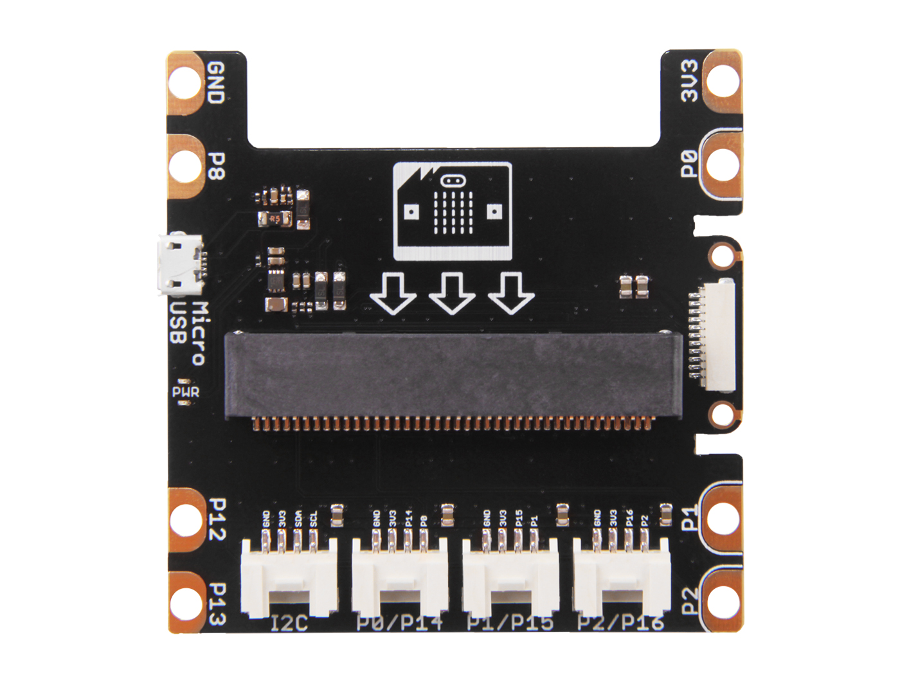

Cette carte est pratique a utilisé avec les modules Grove.

**Attention** La carte fonctionne sous 3.3V, certains modules pour l'Arduino ne fonctionneront pas !

D'autres modules peuvent fonctionner mais leurs bibliothèques ne sont pas disponibles.

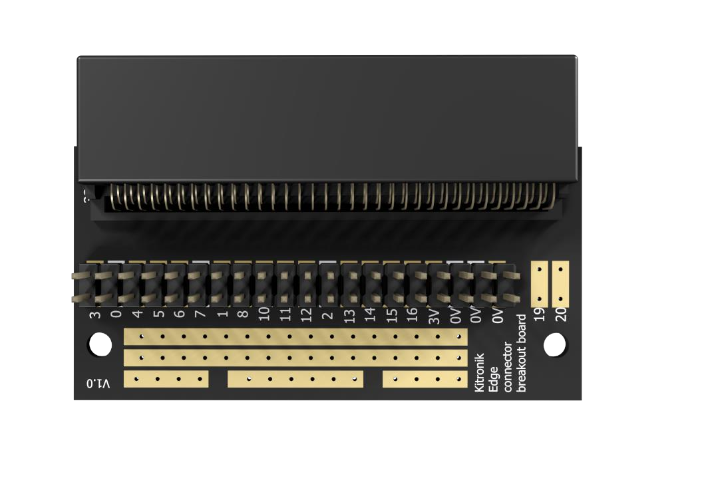

Cette carte est à réserver aux enseignants et aux élèves qui font attention.

Les capteurs externes
----------------------
- [Afficheur LCD I2C](#Afficheur-LCD-I2C-Grove)
- [Barrière Infrarouge](#Barrière-Infrarouge)
- [Capteur de luminosité (entrée analogique)](#Capteur-de-luminosité-GA1A1S202WP-entrée-analogique)
- [Capteur de température et humidité DHT 11 Grove.](#Capteur-de-température-et-humidité-DHT-11-Grove)
- [Horloge temps réel DS3231 RTC (bus I2C)](#Horloge-temps-réel-DS3231-RTC-bus-I2C)
- [Capteur de particules fines SDS011 (UART liaison série)](#Capteur-de-particules-fines-SDS011-UART-liaison-série)
- [Programmes de visualisation de données pour les particules fines en python.](#On-peut-aussi-afficher-la-valeur-avec-ce-programme-PMSensor_pyplotipynb-sous-Jupyter-Notebook)
- [Récepteur GPS (UART liaison série)](#Récepteur-GPS-UART-liaison-série)
- [Sortie Transistor MOSFET](#Sortie-transistor-mosfet)

Afficheur LCD I2C Grove
-----------------------

**Attention** tous les afficheurs ne fonctionnent pas sous 3.3V, l'afficheur LCD_I2C RGB Grove ne fonctionne pas sous 3.3V par contre l'afficheur LCD_I2C Grove (Black on Yellow) fonctionne en 3.

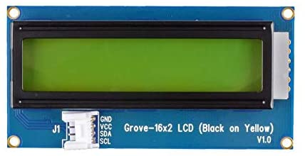

Voici un exemple très simple avec Vittascience :

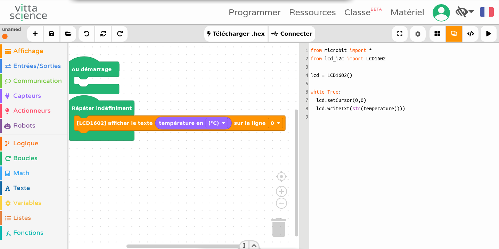

L'afficheur affiche la température du processeur de la carte Micro:bit.

On pourra améliorer l'affichage en précisant sur la ligne 1 un texte et la ligne 2 la température ainsi que °C

Évidemment, on pourra afficher d'autres choses...

Barrière Infrarouge
-------------------
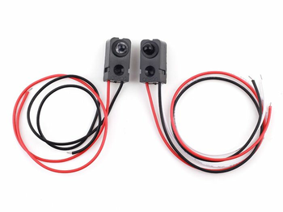

La [documentation](https://www.seeedstudio.com/300mm-Infrared-shooting-sensor-p-2308.html) nous dit qu'il fonctionne en 5V mais il peut fonctionner en 3.3V

 - Il y a un émetteur avec 2 fils pour l'alimentation.
 - Un récepteur avec 3 fils que j'ai branché avec un adaptateur sur P0/P14

 Pour lire une entrée en micropython nous avons la fonction read_digital() qui doit être associée à une broche (pin)

 Exemple :

```python
from microbit import pin14
print(pin14.read_digital())
```

Cela ne fonctionne pas !

**Pourquoi ?**

Regardons la documentation en micropython de la carte microbit sur [les entrées sorties](https://microbit-micropython.readthedocs.io/fr/latest/pin.html)

*The pull mode for a pin is automatically configured when the pin changes to an input mode. Input modes are when you call read_analog / read_digital / is_touched. The default pull mode for these is, respectively, NO_PULL, PULL_DOWN, PULL_UP. Calling set_pull will configure the pin to be in read_digital mode with the given pull mode.*

Concrètement, la fonction read_digital configure l'entrée en PULL_DOWN (résistance de tirage vers le bas) pour de [plus amples explications](Hardware/microbit_hardware_V1-5.md)

Cette résistance de Pull-Down affaiblit le signal du récepteur Infrarouge.

Nous allons ne pas mettre de résistance de tirage, ni vers le bas, ni vers le haut, avec l'instruction set_pull(pin14.NO_PULL) :

```python
pin14.set_pull(pin14.NO_PULL)
print(pin14.read_digital())
```

Cette fois-ci, la barrière infrarouge fonctionne !

Pour information, l'instruction is_touched() ne fonctionne pas pour la broche 14, mais elle fonctionne sur la broche 0.

- L'instruction  is_touched() répond True (Vrai) si le niveau est "0"
- L'instruction  is_touched() répond False (Faux) si le niveau est "1"

Cela est logique puisqu'il utilise un Pull-Up mais pour notre barrière :

- Un obstacle correspondra à Vrai
- Une bonne réception correspond à Faux (pas d'obstacle)

**Attention** pour les entrées, il faut faire attention à la configuration.

### Piloter l'émetteur IR

Enfin on peut aussi piloter l'émetteur infrarouge avec la fonction write_digital(value)

- value = 0, émetteur éteint,
- value = 1, émetteur allumé.

Capteur de luminosité GA1A1S202WP (entrée analogique)
-----------------------------------------------------

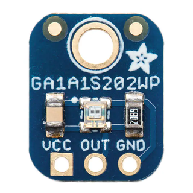

Le capteur [GA1A1S202WP](https://cdn-shop.adafruit.com/datasheets/GA1A1S202WP_Spec.pdf)

Ce capteur permet de mesurer la luminosité de 3 à 55000 lux avec une fonction exponentielle.

```python
import microbit
valeur=microbit.pin2.read_analog()
lux=10**(valeur*4.74/1024)
print(lux)
```

Capteur de température et humidité DHT 11 Grove
-----------------------------------------------

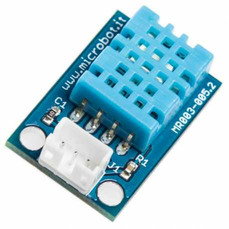

Voici le programme principal du DHT11

```python
sensor = DHT11(uBit.pin1)
while True:
    try:
        t , h = sensor.read()
        print("%2.1f%sC  %2.1f%% " % (t, DEGREES, h))
    except DataError as e:
        print("Error : " + str(e))

    time.sleep(2)
```

Il faut une bibliothèque spécifique la classe DHT11 à télécharger depuis github [https://github.com/rhubarbdog/microbit-dht11/blob/master/dht11.py](https://github.com/rhubarbdog/microbit-dht11/blob/master/dht11.py)

Horloge temps réel DS3231 RTC (bus I2C)
---------------------------------------

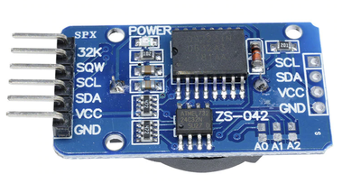

Cette Horloge temps réel permet de la mettre à l'heure et ensuite de lire la date et l'heure.
On peut aussi mettre 2 alarmes mais elles ne sont pas gérées dans le code ci-dessous.

```python
from microbit import *

def bcd2dec(bcd):
    return (((bcd & 0xf0) >> 4) * 10 + (bcd & 0x0f))

def dec2bcd(dec):
    tens, units = divmod(dec, 10)
    return (tens << 4) + units

def get_time():
    i2c.write(addr, b'\x00', repeat=False)
    buf = i2c.read(addr, 7, repeat=False)
    bufs[0] = bcd2dec(buf[0])
    bufs[1] = bcd2dec(buf[1])
    if buf[2] & 0x40:
        hh = bcd2dec(buf[2] & 0x1f)
        if buf[2] & 0x20:
            hh += 12
    else:
        hh = bcd2dec(buf[2])
    bufs[2]=hh
    bufs[3] = buf[3]
    bufs[4] = bcd2dec(buf[4])
    bufs[5] = bcd2dec(buf[5] & 0x1f)
    bufs[6] = bcd2dec(buf[6])
    return bufs

def set_time(s,m,h,w,dd,mm,yy):
    t = bytes([s,m,h,w,dd,mm,yy-2000])
    for i in range(0,7):
        i2c.write(addr, bytes([i,dec2bcd(t[i])]), repeat=False)
    return

addr = 0x68
buf = bytearray(7)
bufs = bytearray(7)
set_time(15,03,22,3,23,12,2020)
sleep(1000)

def affichage_temps() :
    temps=get_time()
    heure=' '+str(temps[2])+":"+str(temps[1])+":"+str(temps[0])
    jour=str(temps[4])+"/"+str(temps[5])+"/"+str(2000+temps[6])
    uart.write(jour)
    uart.write(heure)
    uart.write('\n')

if __name__ == '__main__':
    affichage_temps()
```
Les sources : [http://www.multiwingspan.co.uk/micro.php?page=rtc](http://www.multiwingspan.co.uk/micro.php?page=rtc)

Il existe aussi une [bibliothèque sur github](https://github.com/shaoziyang/microbit-lib/blob/master/misc/DS3231/DS3231.py)

Capteur de particules fines SDS011 (UART liaison série)
-------------------------------------------------------

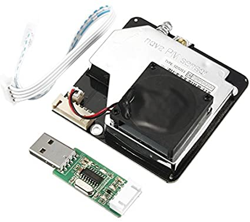

Ce capteur fonctionne avec la liaison série.

Voici les [informations utiles](Externe/Laser_PM2-5_Sensor.md) pour s'en servir.

Comme vous pouvez le voir dans ce programme, on bascule la liaison série entre le capteur de particules fines et l'écran du PC via le port USB pour afficher les valeurs de PM10 et PM2.5

```python
import microbit,utime
microbit.uart.init(baudrate=9600,tx = microbit.pin0, rx = microbit.pin1) # init de la liaison série du capteur de particules fines SDS011 , vitesse 9600 bauds
def verification(donnees): #on vérifie les données reçues voir doc SDS011
    checksum=sum(donnees[2:8])%256
    if (len(donnees) == 10) and (donnees[0] ==170) and (donnees[1] ==192) and (donnees[9] ==171) and (donnees[8] ==checksum) :
        return {"PM 2.5":(256*donnees[3]+donnees[2])/10, "PM 10":(256*donnees[5]+donnees[4])/10, "Temps":utime.ticks_ms()} #dictionnaires
    else:
        return {"PM 2.5":None, "PM 10":None,"Temps":utime.ticks_ms() }
while True : #boucle sans fin
    # microbit.sleep(10)
    if microbit.uart.any() : # caractères reçus depuis le capteur de particules fines SDS011 ?
        content=microbit.uart.read(10) #lecture de 10 caractères voir DOC SDS011
        message=[c for c in content] #pour transformer les 'bytes' en décimal
        microbit.uart.init(baudrate=115200) # on remet la liaison série sur l'USB et on change la vitesse à 115200 bauds
        #print(content) # Pour voir les données brutes
        #print(message) # Pour voir les données en décimal
        print(verification(message)) # Pour n'afficher que les PM 2.5 et PM 10
        microbit.uart.init(baudrate=9600,tx = microbit.pin0, rx = microbit.pin1)  # init de la liaison série du capteur de particules fines SDS011
```

Ce programme affiche un dictionnaire python avec 3 arguments PM2.5 et sa valeur µg/m3, PM10 et sa valeur en µg/m3 ainsi temps et sa valeur en ms. C'est la forme la plus simple d'un fichier json.

### On peut aussi afficher la valeur avec ce programme PMSensor_pyplot.ipynb sous Jupyter Notebook

Voici [ce programme](Jupyter/PMSensor_pyplot/PMSensor_pyplot.md)

Récepteur GPS (UART liaison série)
----------------------------------

Capteur GY-NE06MV2 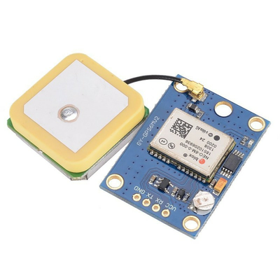

Le principe de fonctionnement reste identique aux capteur de particules, la liaison série permet de lire l'information GPS du capteur et de l'afficher sur l'écran du PC.

```python
import microbit,utime
microbit.uart.init(baudrate=9600,tx = microbit.pin0, rx = microbit.pin1) # init GPS NEO

while True : #boucle sans fin
    microbit.sleep(10)
    if microbit.uart.any() : # caractères reçus depuis le capteur de particules fines SDS011 ?
        content=microbit.uart.read() #lecture de 10 caractères voir DOC SDS011
        if 'GPRMC' in content :
            microbit.uart.init(baudrate=115200) # on remet la liaison série sur l'USB et on change la vitesse à 115200 bauds
            message = content.split()[0] #on prend le premier terme de GPRMC avant un caractère spécial
            print(message) # Pour voir les données brutes
            microbit.uart.init(baudrate=9600,tx = microbit.pin0, rx = microbit.pin1)
```

Ici on affiche les données brutes de la trame  GPRMC

À partir de cette documentation extraite de [https://fr.wikipedia.org/wiki/NMEA_0183](https://fr.wikipedia.org/wiki/NMEA_0183)

$GPRMC,053740.000,A,2503.6319,N,12136.0099,E,2.69,79.65,100106,,,A*53

 - $GPRMC       : type de trame
 - 053740.000   : heure UTC exprimée en hhmmss.sss : 5 h 37 min 40 s
 - A            : état A=données valides, V=données invalides
 - 2503.6319    : Latitude exprimée en ddmm.mmmm : 25° 03.6319' = 25° 03' 37,914"
 - N            : indicateur de latitude N=nord, S=sud
 - 12136.0099   : Longitude exprimée en dddmm.mmmm : 121° 36.0099' = 121° 36' 00,594"
 - E            : indicateur de longitude E=est, W=ouest
 - 2.69         : vitesse sur le fond en nœuds (2,69 nd = 3,10 mph = 4,98 km/h)
 - 79.65        : route sur le fond en degrés
 - 100106       : date exprimée en qqmmaa : 10 janvier 2006
 - ,            : déclinaison magnétique en degrés (souvent vide pour un GPS)
 - ,            : sens de la déclinaison E=est, W=ouest (souvent vide pour un GPS)
 - A            : mode de positionnement A=autonome, D=DGPS, E=DR
 - *53          : somme de contrôle de parité au format hexadécimal3

Afficher l'heure UTC et la date ainsi que la latitude et la longitude.

Pour faire une liste des termes séparés par une virgule en python, on pourra utiliser la fonction split(',')

Sortie Transistor MOSFET
=========================

On va utiliser un module transistor très simple pour allumer un bandeau de 12 leds

Voici le schéma : 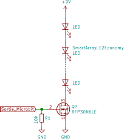

Il faut une alimentation extérieure de 9 V

On peut piloter la lampe de 2 façons :

 1. Sortie numérique tout ou rien fonction write_digital(valeur) # valeur = 0 ou 1
 2. Sortie MLI/PWM pseudo analogique write_analog(valeur) # 0 < valeur <1024

La PWM fonctionne sur 12 bits (1024 valeurs) de 0 à 1023, pas de 0.1%  

La fréquence de la période peut être réglé par 2 fonctions :

 - set_analog_period(period) : Set the period of the PWM signal being output to period in milliseconds. The minimum valid value is 1ms.

- set_analog_period_microseconds(period) : Set the period of the PWM signal being output to period in microseconds. The minimum valid value is 256µs.


Ce programme permet de faire varier la luminosité de la lampe avec une sortie MLI/PWM :

```python
for i in range(20):
  pin16.write_analog(i*50)
  sleep(1000)
```

### Commande Moteur  

On peut aussi piloter des moteurs mais attention de nombreuses cartes fonctionnent en 5V en entrée.  
Il faudra adapter les signaux de la carte Micro:bit qui fonctionne en 3.3V.

Conclusion
===========

Limite de la carte Microbit, cette carte me semble largement suffisante en seconde et première pour découvrir la programmation.

Par contre, si on veut mettre certains capteurs et l'afficheur LCD, la carte est insuffisante, mémoire insuffisante.

Pour les terminales, on pourra utiliser d'autres cartes plus puissantes qui fonctionnent avec Micropython.

Cartes Pyboard, ESP8266, ESP32 ...

À voir la [carte Microbit V2](https://microbit.org/new-microbit/)
