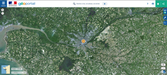
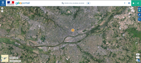
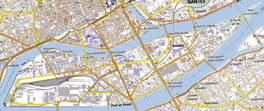
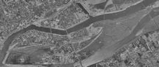

Cartographie et localisation
=============================

Sciences Numériques et Technologie SNT

1 Recherche de coordonnées géographiques d’un lieu
---------------------------------------------------

Sur le site https://www.geoportail.gouv.fr ,   
1.1 trouver les coordonnées géographiques de la Tour Eiffel, les indiquer ci-dessous.    
1.2 du lycée Joliot Curie,144 boulevard de Vitré à Rennes, les indiquer ci-dessous.   
1.3 de chez vous, les indiquer ci-dessous.   
b) Dans quel ordre sont données les coordonnées géographiques sur ce portail de visualisation de données géographiques ?   

2 Recherche de cartes numériques d’une ville
---------------------------------------------

Toujours sur le site https://www.geoportail.gouv.fr , chercher la ville de Nantes (44000) et afficher une
photo aérienne de cette ville.  

Zoomer pour réduire votre zone d’affichage. 

2.1 En zoomant au maximum, quels types de détails peut-on voiture dans la ville ?   

3 Utilisation d’outils cartographiques
---------------------------------------

Nantes est traversée par le fleuve de La Loire et dans la partie sud de la ville, une « île » est formée par le fleuve : L’île de Nantes (parfois dénommée île Beaulieu).
Elle constitue l'un des 11 quartiers de la ville.

3.1 À l’aide de l’outil de mesure de distance, mesurer sur la photo aérienne la longueur d’Est en Ouest de l’île de Nantes.   
Quelle est cette longueur ?    

3.2 A l’aide de l’outil de mesure de surface, chercher une estimation de la surface totale de l’île de Nantes.   
Quelle est approximativement cette surface ?    

4 Utilisation de différents fonds de carte
-------------------------------------------
Nous allons quitter Géoportail pour [remonter le temps](https://remonterletemps.ign.fr/)

En restant sur une vue globale de l’île de Nantes, utiliser différents fonds de carte pour afficher des renseignements différents et issus de différentes époques de cette zone géographique.

4.1 En comparant les photos aériennes et les cartes de 1950 à celles d’aujourd’hui, que remarquez-vous sur l’évolution urbaine de l’île de Nantes ?    
