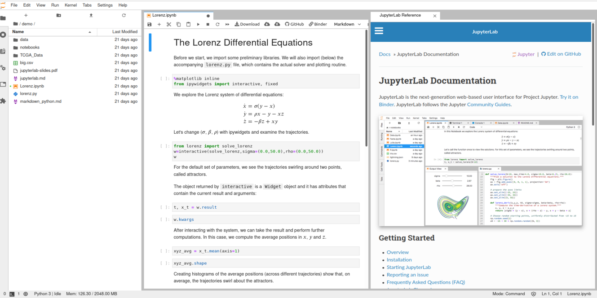
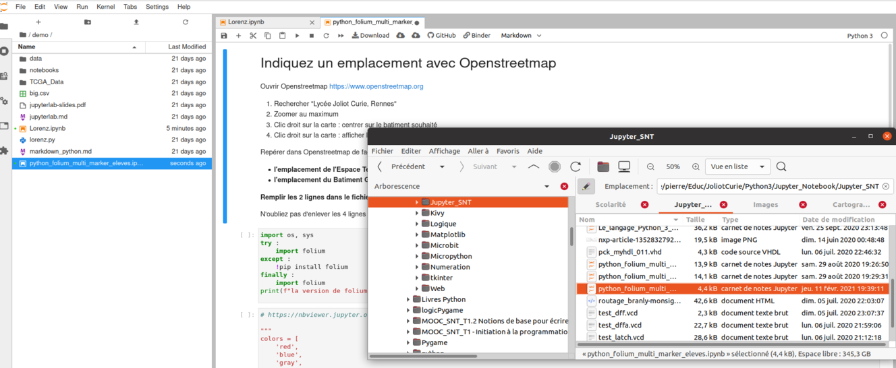

Géolocalisation et marqueur avec OpenStreetmap sur JupyterLab
=============================================================

Utilisation de JupyterLab online sur [Jupyter.org](https://jupyter.org/)
------------------------------------------------------------------------

Ouvrir dans un navigateur [Jupyter.org](https://jupyter.org/)

Cliquez sur : [try it in your browser](https://jupyter.org/try)

Cliquez sur : [Try JupyterLab](https://mybinder.org/v2/gh/jupyterlab/jupyterlab-demo/master?urlpath=lab/tree/demo)

Vous devriez obtenir cette page :

- Maintenant, il faut déposer le NoteBook que nous allons faire.
- Ce Notebook à une extension ipynb
- Ouvrir l'explorateur de fichier
- Glisser déposer votre fichier "python_folium_multi_marker_eleves.ipynb" avec un « glisser déposer », 'drag and drop'

Il faut ensuite double cliquer sur le fichier déposé "python_folium_multi_marker_eleves.ipynb" pour le voir apparaître sur la fenêtre de droite. Penser à fermer la partie documentation pour mieux voir votre fichier.

Un fichier Notebook comprend 2 types de cellules :

- Des cellules de texte qui vous informe et vous donne des consignes
- Des cellules de code, nous travaillerons toujours en Python
    - Ces cellules de Python devront parfois être complétées ou modifiées et ensuite exécutées.

N'oubliez pas de sauvegarder vos fichiers sur votre ordinateur avec 'download'

Voici le contenu du Notebook :  [python_folium_multi_marker_eleves.ipynb](python_folium_multi_marker_eleves.ipynb)
